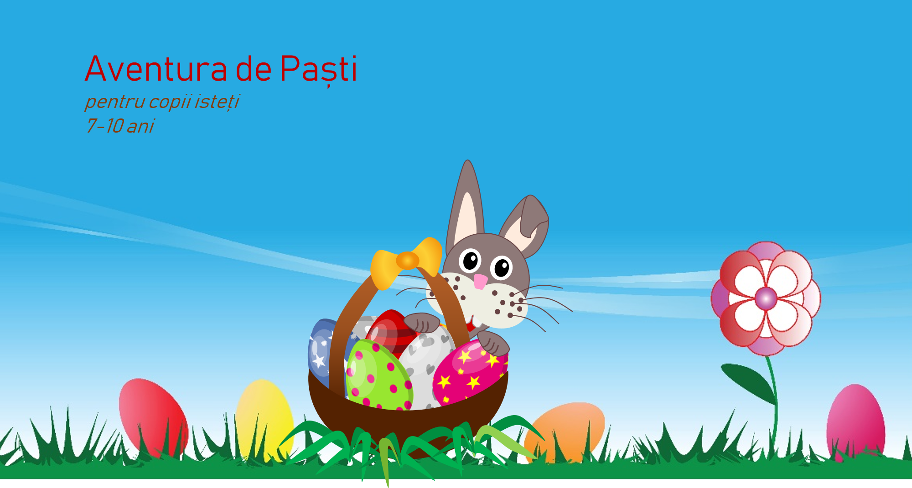
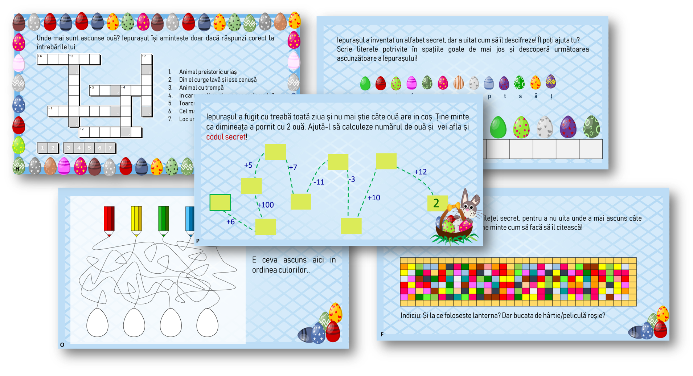
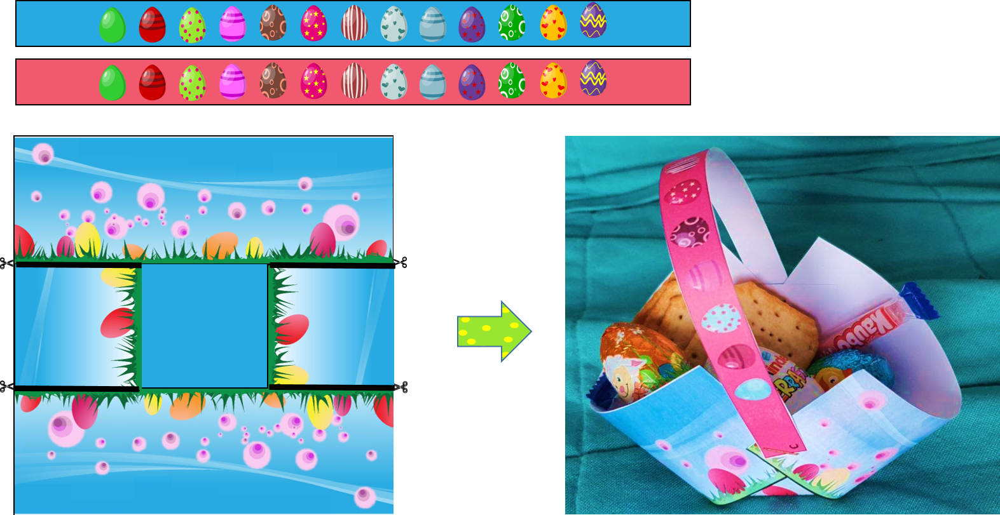

# Aventura De Paști

## Exemple de provocări

## Coșul de Paști

Vă invit în o aventură de Paști care se joacă acasă în stil Escape Room. Am creat joaca pentru copiii mei de 4 și 7 ani, cărora le-a plăcut foarte mult. Sper să va placă și vouă! 

Găsiți toate cele necesare jocului aici: https://github.com/IrinaSKY/AventuraDePasti 

**Durata:** puțin peste o oră, mai mult dacă faceți mici pause.

**Numărul de jucători:** 1-4. 

**Pentru versiunea cea mai simplă, printați [acest document PDF](AventuraDePasti.pdf) și urmați instrucțiunile.** Puteți sări peste unele sarcini dacă vi se par prea complicate (e.g. provocarea cu șah), dar trebuie sa aveți grijă să rearanjați locațiile indiciilor (iarăși, atenție la tabel!)

Pentru 2 jucători sau mai multi, puteți tăia unele indicii/provocări în mai multe bucăti. E.g. pentru ascunzătoarea ÎNCĂLȚĂMINTE, puteți pune câte o bucată din provocarea cu șah in câteva încălțăminte aparținînd jucătorilor. Printați elementele D și C de atâtea ori, câți jucători aveți.

Pentru versiunea avansată (consumatoare de timp) puteți să modificați joaca direct in [documentul PPT] din proiect pentru a o corecta sau personaliza. Sunteți bineveniți să contribuiți la acest proiect cu corecții, feedback și conținut, dar și cu raportare de erori.

Proiectul este sub licență MIT, deci puteți folosi, modifica și redistribui conținutul fără limitări, dar să menționați sursa originală.

Mă voi bucura de feedback. Aventură plăcută!

### Muțumiri autorilor următoarelor resurse:

- Fundalul cu flori și iarbăpreluat de aici: Free photo 4402421 © remg - Dreamstime.com
- Iepurașul inspirat de Free photo 95609261 © Publicdomainphotos - Dreamstime.com
- Coșulețul instrucțiuni si idee https://www.homemade-gifts-made-easy.com/paper-easter-basket.html
- Codul secret roșu inspirat de https://www.indigoimage.com/secretmsg/cosmic.html
- Cuvinte încrucișate generate aici - https://www.xwords-generator.de/de
- Calul de șah preluat de aici http://getdrawings.com/chess-knight-vector
